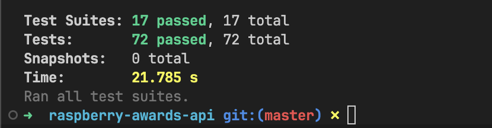

<a href="https://www.npmjs.com/~nestjscore" target="\_blank"></a>

Idiomas: <a href="/README.md" target="_blank">US: 🇺🇸</a>

# Prêmios Framboesa App

Desenvolver uma aplicação web com uma API RESTful para possibilitar a leitura da lista
de indicados e vencedores da categoria Pior Filme do Golden Raspberry Awards,
utilizando React para o frontend, Node.js para o backend, e MongoDB como banco de
dados.

<div align="center">


<div align="start">

## Dependências e tecnologias

Este projeto usa várias dependências para gerenciar diferentes aspectos da aplicação. Abaixo está uma lista das principais dependências.

- **@nest-middlewares/morgan**: Middleware para registro de requisições HTTP.
- **@nestjs/cache-manager**: Módulo de gerenciamento de cache para NestJS.
- **@nestjs/swagger**: Integração do Swagger para documentação de API.
- **@nestjs/terminus**: Verificações de saúde e monitoramento para aplicações NestJS.
- **cache-manager**: Biblioteca geral de gerenciamento de cache.
- **exceljs**: Biblioteca para leitura e escrita de arquivos Excel.
- **mongoose**: Ferramenta de modelagem de objetos MongoDB.
- **nestjs-cls**: Armazenamento Local de Continuação (CLS) para NestJS.
- **uuid**: Biblioteca para geração de UUIDs.
- **winston**: Biblioteca para Logging .
- **winston-daily-rotate-file**: Transport para rotação diária de arquivos de log.
- **winston-transport**: Transport base para Winston.
- **zod**: Biblioteca de declaração e validação de esquemas orientada a TypeScript.
  Transport

## Começando

### Executando a Aplicação no Docker

Esta aplicação é conteinerizada usando Docker. Para construir e executar a aplicação em um contêiner Docker, siga os passos abaixo:

### Pré-requisitos

Certifique-se de ter Docker e Docker Compose instalados em sua máquina.

- [Docker](https://docs.docker.com/get-docker/)
- [Docker Compose](https://docs.docker.com/compose/install/)

### 1. Clone o Repositório

```bash
git clone https://github.com/Dikendev/raspberry-awards-api
cd raspberry-awards-api
```

### 2. Arquivo Env

Aqui está um exemplo de um arquivo .env para executar a aplicação

```plaintext
PORT=3000
NODE_ENV='dev'
ORGANIZATION=report
CONTEXT=raspberry
APP=HUB

DATABASE_URL="mongodb://localhost:27017"
```

### 3. Instalação

Para instalar todas as dependências, use o gerenciador de pacotes [npm](https://www.npmjs.com/)

```bash
npm install
```

### 4. Construir e Executar a Aplicação

Use o Docker Compose para construir e executar a aplicação junto com o serviço MongoDB:

```bash
docker compose up --build
```

Se precisar apenas subir o contêiner do serviço MongoDB ou da aplicação separadamente, você pode executar:

```bash
docker-compose up nestjs-app --build
```

E executar o serviço de contêiner do mongodb:

```bash
docker compose up mongo --build
```

### 5. Acessar a Aplicação

Uma vez que os contêineres estejam em execução, você pode acessar sua aplicação NestJS em:

```bash
http://localhost:3000
```

O banco de dados MongoDB estará em execução em:

```bash
mongodb://localhost:27017
```

### 6. Parar os Contêineres

Quando terminar, você pode parar e remover os contêineres em execução executando:

```bash
docker-compose down
```

Este comando irá parar e remover todos os contêineres, redes e volumes definidos no arquivo docker-compose.yml.

## Comandos Adicionais

### Reconstruir os Contêineres

Se precisar reconstruir os contêineres sem cache, você pode usar o seguinte comando:

```bash
docker-compose up --build --force-recreate --no-deps

```

### Ver Logs

Para visualizar os logs dos contêineres em execução:

```bash
docker-compose logs -f
```

## Cobertura de Testes



<br/>

## Como foi feita a analise do CSV

### Identificando cada item na linha


<br/>

Aqui estou demonstrando como o algoritmo funciona. Primeiro, localizo o filme e, em seguida, extraio e listo todos os estúdios e produtores da linha, separando-os por vírgulas e pela palavra 'and'. Isso me permite contá-los de forma eficaz.

Então a TriStar Pictures está **associado a 8 filmes** neste exemplo.

Ao usar essa estratégia, consegui medir com mais precisão a quantidade de filmes para cada **produtor e estúdio.**

### Criando a estrutura para salvar no banco


<br/>

Neste exemplo, o filme Daddy Day Camp será salvo no banco de dados com a relação com os dois estúdios **(TriStar Pictures e Revolution Studios)** e os três produtores **(Matt Berenson, John Davis e Wyck Godfrey)**.

Dessa forma, será criado um banco de dados contendo todas as informações necessárias sobre os filmes.

## Documentação da API

### Swagger

Você pode verificar o Swagger rodando na porta:

```bash
http://localhost:3000/api/sw#/
```

### Coleções do Postman

### Baixar e Instalar o Postman:

Coleção do Postman <a href="/src/public/raspberry-awards-api.postman_collection.json" target="_blank">**_Acessar arquivo .json_**</a>

Se você ainda não tem, baixe e instale o Postman no site oficial.

### Importar a Coleção do Postman:

- Abra o Postman.
- Clique no botão Importar localizado no canto superior esquerdo.
- Selecione a aba Arquivo.
- Clique em Escolher Arquivos e selecione o arquivo da coleção do Postman (.json) que você possui.

## Serviço de LOG (Monitoramento)

### Morgan

Morgan é um middleware para registrar solicitações HTTP em aplicações Node.js. Ele fornece uma maneira simples e personalizável de registrar solicitações recebidas, incluindo detalhes como método da solicitação, URL, código de status e tempo de resposta. Isso ajuda a monitorar e depurar o tráfego HTTP da aplicação.

- **Formatos Personalizáveis**: Suporta vários formatos de log predefinidos e permite formatos personalizados.
- **Monitoramento em Tempo Real**: Fornece registro em tempo real de solicitações HTTP, auxiliando na depuração imediata.
- **Suporte a Stream**: Pode ser configurado para transmitir logs para outras bibliotecas de logging como Winston.
- **Desempenho**: Leve e não impacta significativamente o desempenho da aplicação.

### Winston

Winston ajuda a capturar e gerenciar logs de diferentes partes da aplicação, fornecendo uma solução abrangente de logging.

- **Múltiplos Transportes**: Suporta logging para múltiplos destinos como arquivos, bancos de dados e console.
- **Níveis de Log**: Permite definir diferentes níveis de log (por exemplo, info, error, debug) para melhor gerenciamento de logs.
- **Asynchronous Logging**: Handles logging asynchronously, ensuring minimal impact on application performance.

### CLS (Continuation-Local Storage)

CLS (Continuation-Local Storage) é usado para manter o contexto em chamadas assíncronas. Ele permite armazenar e recuperar dados ao longo do ciclo de vida de uma solicitação, mesmo enquanto ela passa por várias operações assíncronas. Isso é particularmente útil para logging, pois permite associar entradas de log a solicitações ou transações específicas, proporcionando melhor rastreabilidade e capacidades de depuração.

- **Preservação de Contexto**: Maintains context across asynchronous operations, ensuring consistent data access.
- **Rastreamento de Solicitações**: Associates log entries with specific requests, improving traceability.
- **Tratamento de Erros**: Melhora o rastreamento de erros ao manter informações de contexto em chamadas assíncronas.
- **Integração**: Integra-se facilmente com bibliotecas de logging como Winston para melhorar o contexto dos logs.

## Rotas

### 1. Saúde da API

- GET /api/health

  - Descrição: Verificar o status de saúde da API.
  - Resposta: Retorna o status de saúde da API.

### 2. Produtores

- POST /api/producers

  - Descrição: Criar um novo produtor.
  - Corpo da Requisição: Objeto JSON contendo os detalhes do produtor.
  - Resposta: Retorna o objeto do produtor criado.

- GET /api/producers

  - Descrição: Recuperar uma lista de todos os produtores.
  - Resposta: Retorna um array de objetos de produtores.

- GET /api/producers/{id}

  - Descrição: Recuperar um produtor pelo ID.
  - Resposta: Retorna o objeto do produtor com o ID especificado.

- PATCH /api/producers/{id}

  - Descrição: Atualizar um produtor pelo ID.
  - Corpo da Requisição: Objeto JSON contendo os detalhes atualizados do produtor.
  - Resposta: Retorna o objeto do produtor atualizado.

- DELETE /api/producers/{id}
  - Descrição: Excluir um produtor pelo ID.
  - Resposta: Retorna uma mensagem de confirmação.

### 3. Estúdios

- POST /api/studio

  - Descrição: Criar um novo estúdio.
  - Corpo da Requisição: Objeto JSON contendo os detalhes do estúdio.
  - Resposta: Retorna o objeto do estúdio criado.

- GET /api/studio

  - Descrição: Recuperar uma lista de todos os estúdios.
  - Resposta: Retorna um array de objetos de estúdios.

- GET /api/studio/{id}

  - Descrição: Recuperar um estúdio pelo ID.
  - Resposta: Retorna o objeto do estúdio com o ID especificado.

- PATCH /api/studio/{id}

  - Descrição: Atualizar um estúdio pelo ID.
  - Corpo da Requisição: Objeto JSON contendo os detalhes atualizados do estúdio.
  - Resposta: Retorna o objeto do estúdio atualizado.

- DELETE /api/studio/{id}

  - Descrição: Excluir um estúdio pelo ID.
  - Resposta: Retorna uma mensagem de confirmação.

### 4. Movies

- POST /api/movie

  - Descrição: Criar um novo filme.
  - Corpo da Requisição: Objeto JSON contendo os detalhes do filme.
  - Resposta: Retorna o objeto do filme criado.

- GET /api/movie

  - Descrição: Recuperar uma lista de todos os filmes.
  - Resposta: Retorna um array de objetos de filmes.

- GET /api/movie/{id}

  - Descrição: Recuperar um filme pelo ID.
  - Resposta: Retorna o objeto do filme com o ID especificado.

- PATCH /api/movie/{id}

  - Descrição: Atualizar um filme pelo ID.
  - Corpo da Requisição: Objeto JSON contendo os detalhes atualizados do filme.
  - Resposta: Retorna o objeto do filme atualizado.

- DELETE /api/movie/{id}
  - Descrição: Excluir um filme pelo ID.
  - Resposta: Retorna uma mensagem de confirmação.

### 5. Analytics

- GET /api/analytics/fastest-wins

  - Descrição: Recuperar as análises de vitórias mais rápidas.
  - Resposta: Retorna os dados das análises.

- GET /api/analytics/largest-gap

  - Descrição: Recuperar as análises de maior diferença de vitórias.
  - Resposta: Retorna os dados das análises.

- GET /api/analytics/movie-counts

  - Descrição: Recuperar as análises de contagem de filmes.
  - Resposta: Retorna os dados das análises.

- GET /api/analytics/movie-counts-by-year

  - Descrição: Recuperar as análises de contagem de filmes por ano.
  - Resposta: Retorna os dados das análises.

- GET /api/analytics/studio-count

  - Descrição: Recuperar as análises de contagem de estúdios.
  - Resposta: Retorna os dados das análises.

- GET /api/analytics/movie-counts-by-studio

  - Descrição: Recuperar as análises de contagem de filmes por estúdio.
  - Resposta: Retorna os dados das análises.

### 6. Upload Files

- POST /api/upload-file/csv

  - Descrição: Fazer upload de um arquivo CSV.
  - Corpo da Requisição: Form-data contendo o arquivo CSV.
  - Resposta: Retorna uma mensagem de confirmação.

### 7. Database Wipe

- DELETE /api/wipe

  - Descrição: Limpar todo o banco de dados.
  - Resposta: Retorna uma mensagem de confirmação.

## Demonstration Images

<div align="center">

### Modalagem Banco de dados


### Branch Workflow


<div align="start">
<br/>

## Conclusion

Project made for interview purpose

## Contributing

Pull requests are welcome <3. Please make sure to update tests as appropriate.

## License

[MIT](https://choosealicense.com/licenses/mit/)
