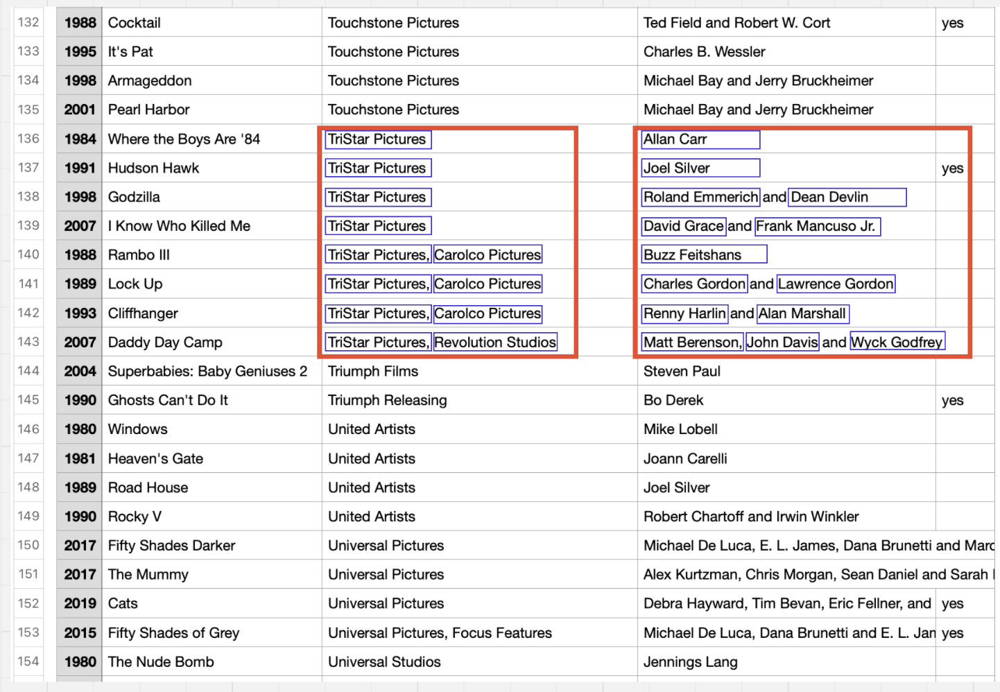
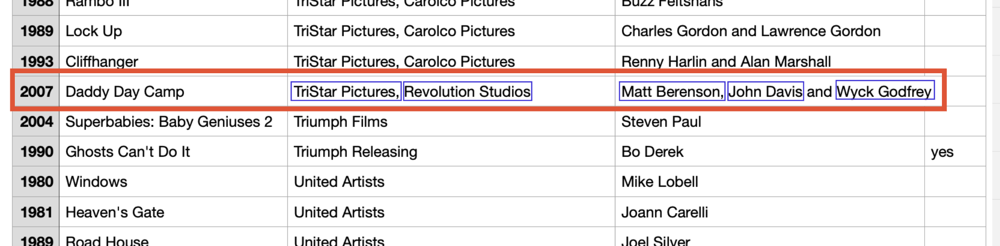
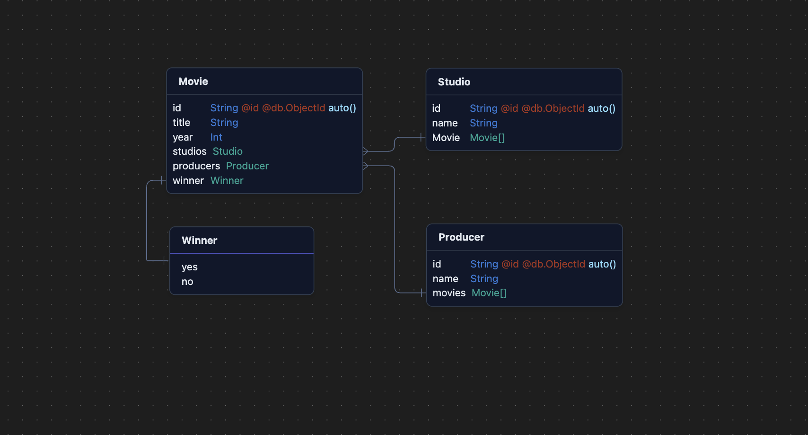
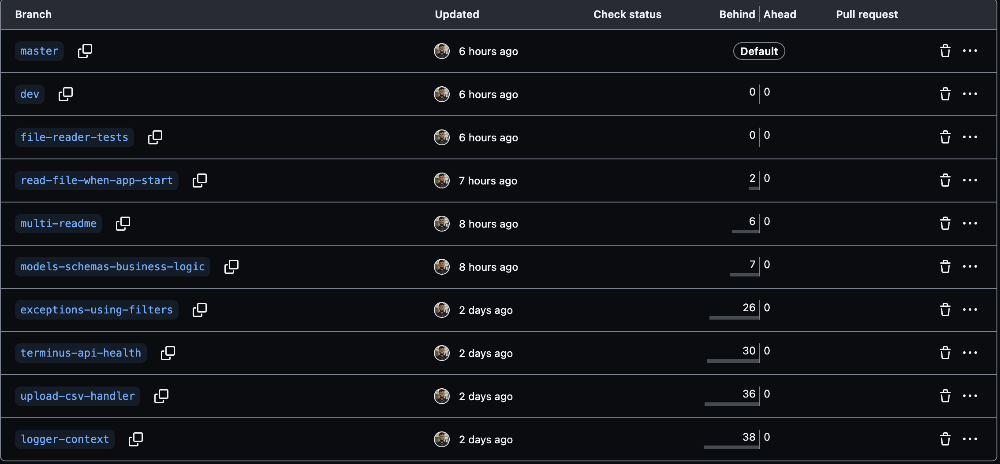

<a href="https://www.npmjs.com/~nestjscore" target="_blank"></a>

Languages: <a href="/README-PT.md" target="_blank">PT_BR: 🇧🇷</a>

# Raspberry Awards Application

Develop a web application with a RESTful API to enable reading the list of nominees and winners of the Worst Picture category of the Golden Raspberry Awards, using React for the frontend, Node.js for the backend, and MongoDB as the database.

## Dependencies and technologies

This project uses various dependencies to manage different aspects of the application. Below is a list of the principal dependencies and development dependencies.

#### mongoose

- ORM to connect with MongoDB, an object modeling tool designed to work in an asynchronous environment.

#### terminus

- Adds health check capabilities to the application and database.

#### winston

- A versatile logging library for Node.js.

#### mongan

- A versatile logging library for Node.js.

#### zod

- TypeScript-first schema validation library.

#### excelJs

- It provides a wide range of features for creating, reading, modifying, and formatting Excel files.

## Getting Started

### Running the Application in Docker

This application is containerized using Docker. To build and run the application in a Docker container, follow the steps below:

### Prerequisites

Make sure you have Docker and Docker Compose installed on your machine.

- [Docker](https://docs.docker.com/get-docker/)
- [Docker Compose](https://docs.docker.com/compose/install/)

### 1. Clone the Repository

```bash
git clone https://github.com/Dikendev/raspberry-awards-api
cd raspberry-awards-api
```

### 2. Env file

Here is an example of a `.env` file to run the application

```plaintext
PORT=3000
NODE_ENV='dev'
ORGANIZATION=report
CONTEXT=raspberry
APP=HUB

DATABASE_URL="mongodb://localhost:27017"
```

### 3. Installation

To install all the dependencies, use the package manager [npm](https://www.npmjs.com/)

```bash
npm install
```

### 4. Build and Run the Application

Use Docker Compose to build and run the application along with the MongoDB service:

```bash
docker compose up --build
```

If need to only to up the container of MongoDB service or the application separated, you can run:

```bash
docker-compose up nestjs-app --build
```

And run the mongo service app:

```bash
docker compose up mongo --build
```

### 5. Access the Application

Once the containers are up and running, you can access your NestJS application at:

```bash
http://localhost:3000
```

The MongoDB database will be running at:

```bash
mongodb://localhost:27017
```

### 6. Stop the Containers

When you're done, you can stop and remove the running containers by executing:

```bash
docker-compose down
```

This command will stop and remove all containers, networks, and volumes defined in the docker-compose.yml file.

## Additional Commands

### Rebuild the Containers

If you need to rebuild the containers without caching, you can use the following command:

```bash
docker-compose up --build --force-recreate --no-deps

```

### View Logs

To view the logs of the running containers:

```bash
docker-compose logs -f
```

## How the CSV analysis was done

### Identifying each item in the row



<br/>

Here I'm demonstrating how the algorithm works. First, I locate the movie, and then I extract and list all the studios and producers from the row, separating them by commas and the word 'and.' This allows me to count them effectively.

So TriStar Pictures is **associated with 8 movies** in this example.

By using this strategy, I was able to more accurately measure the number of movies for each **producer and studio.**

### Creating the structure to save in the database



<br/>

In this example, the movie Daddy Day Camp will be saved in the database with its associations to both studios **(TriStar Pictures and Revolution Studios)** and all three producers **(Matt Berenson, John Davis, and Wyck Godfrey)**.

This will create a database that contains all the necessary information about the movies.

## Api Documentations

### Swagger

You can check the swagger running at port:

```bash
http://localhost:3000/api/sw#/
```

### Postman collections

### Download and Install Postman:

Postman collection <a href="/src/public/raspberry-awards-api.postman_collection.json" target="_blank">**_Access .json file_**</a>

If you haven't already, download and install Postman from the official website.

### Import the Postman Collection:

- Open Postman.
- Click on the Import button located at the top left corner.
- Select the File tab.
- Click on Choose Files and select the Postman collection file (.json) you have.

## LOG Service (Monitoring)

### Morgan

Morgan is a middleware for logging HTTP requests in Node.js applications. It provides a simple and customizable way to log incoming requests, including details such as the request method, URL, status code, and response time. This helps in monitoring and debugging the application's HTTP traffic.

- **Customizable Formats**: Supports various predefined log formats and allows custom formats.
- **Real-time Monitoring**: Provides real-time logging of HTTP requests, aiding in immediate debugging.
- **Stream Support**: Can be configured to stream logs to other logging libraries like Winston.
- **Performance**: Lightweight and does not significantly impact application performance.

### Winston

Winston helps in capturing and managing logs from different parts of the application, providing a comprehensive logging solution.

- **Multiple Transports**: Supports logging to multiple destinations like files, databases, and the console.
- **Log Levels**: Allows setting different log levels (e.g., info, error, debug) for better log management.
- **Custom Formats**: Supports custom log formats, including JSON and timestamped logs.
- **Asynchronous Logging**: Handles logging asynchronously, ensuring minimal impact on application performance.
- **Extensible**: Easily extendable with custom transports and plugins.

### CLS (Continuation-Local Storage)

CLS (Continuation-Local Storage) is used to maintain context across asynchronous calls in Node.js. It allows you to store and retrieve data throughout the lifecycle of a request, even as it passes through various asynchronous operations. This is particularly useful for logging, as it enables you to associate log entries with specific requests or transactions, providing better traceability and debugging capabilities.

- **Context Preservation**: Maintains context across asynchronous operations, ensuring consistent data access.
- **Request Tracking**: Associates log entries with specific requests, improving traceability.
- **Error Handling**: Enhances error tracking by maintaining context information across async calls.
- **Debugging**: Simplifies debugging by providing a consistent context throughout the request lifecycle.
- **Integration**: Easily integrates with logging libraries like Winston to enhance log context.

## Routes

### 1. Api Health

- GET /api/health
  - Description: Check the health status of the API.
  - Response: Returns the health status of the API.

### 2. Producers

- POST /api/producers

  - Description: Create a new producer.
  - Request Body: JSON object containing the producer details.
  - Response: Returns the created producer object.

- GET /api/producers

  - Description: Retrieve a list of all producers.
  - Response: Returns an array of producer objects.

- GET /api/producers/{id}

  - Description: Retrieve a producer by ID.
  - Response: Returns the producer object with the specified ID.

- PATCH /api/producers/{id}

  - Description: Update a producer by ID.
  - Request Body: JSON object containing the updated producer details.
  - Response: Returns the updated producer object.

- DELETE /api/producers/{id}
  - Description: Delete a producer by ID.
  - Response: Returns a confirmation message.

### 3. Studios

- POST /api/studio

  - Description: Create a new studio.
  - Request Body: JSON object containing the studio details.
  - Response: Returns the created studio object.

- GET /api/studio

  - Description: Retrieve a list of all studios.
  - Response: Returns an array of studio objects.

- GET /api/studio/{id}

  - Description: Retrieve a studio by ID.
  - Response: Returns the studio object with the specified ID.

- PATCH /api/studio/{id}

  - Description: Update a studio by ID.
  - Request Body: JSON object containing the updated studio details.
  - Response: Returns the updated studio object.

- DELETE /api/studio/{id}
  - Description: Delete a studio by ID.
  - Response: Returns a confirmation message.

### 4. Movies

- POST /api/movie

  - Description: Create a new movie.
  - Request Body: JSON object containing the movie details.
  - Response: Returns the created movie object.

- GET /api/movie

  - Description: Retrieve a list of all movies.
  - Response: Returns an array of movie objects.

- GET /api/movie/{id}

  - Description: Retrieve a movie by ID.
  - Response: Returns the movie object with the specified ID.

- PATCH /api/movie/{id}

  - Description: Update a movie by ID.
  - Request Body: JSON object containing the updated movie details.
  - Response: Returns the updated movie object.

- DELETE /api/movie/{id}
  - Description: Delete a movie by ID.
  - Response: Returns a confirmation message.

### 5. Analytics

- GET /api/analytics/fastest-wins

  - Description: Retrieve the fastest wins analytics.
  - Response: Returns the analytics data.

- GET /api/analytics/largest-gap

  - Description: Retrieve the largest gap wins analytics.
  - Response: Return the analytics data.

- GET /api/analytics/movie-counts
  - Description: Retrieve the movie counts analytics.
  - Response: Returns the analytics data.

### 6. Upload Files

- POST /api/upload-file/csv
  - Description: Upload a CSV file.
  - Request Body: Form-data containing the CSV file.
  - Response: Returns a confirmation message.

### 7. Database Wipe

- DELETE /api/wipe
  - Description: Wipe the entire database.
  - Response: Returns a confirmation message.

## Demonstration Images

<div align="center">

### Database Modeling



### Branch Workflow



<div align="start">
<br/>

## Conclusion

Project made for interview purpose

## Contributing

Pull requests are welcome <3. Please make sure to update tests as appropriate.

## License

[MIT](https://choosealicense.com/licenses/mit/)
